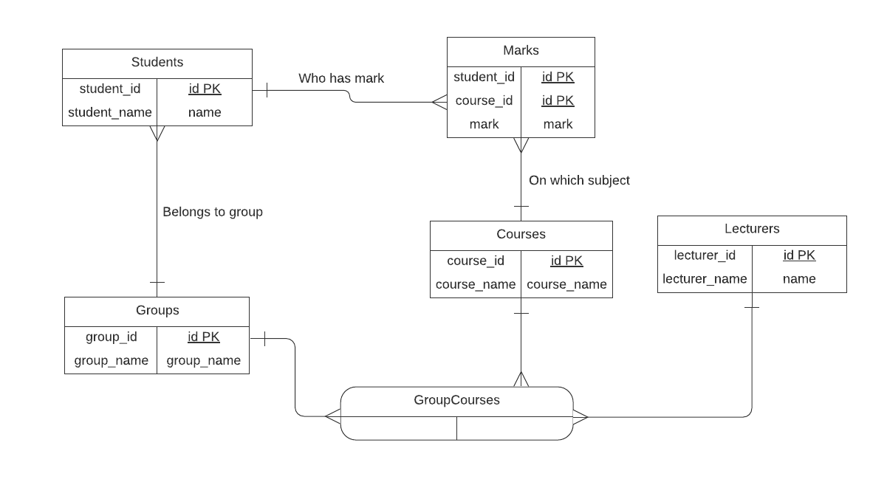
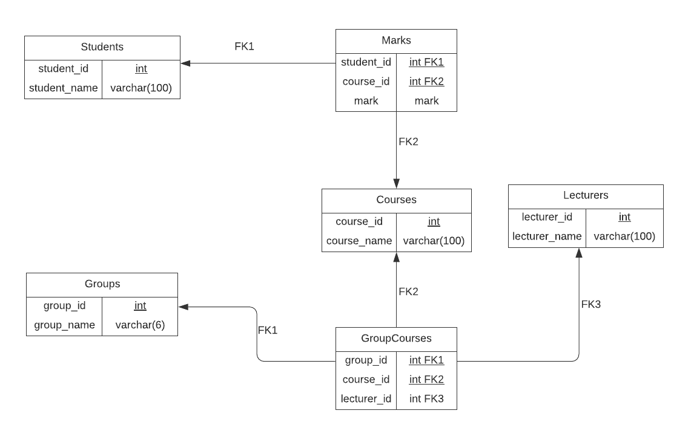

# Homework 4

Relationship with attributes `StudentId`, `StudentName`, `GroupId`, `GroupName`,
`CourseId`, `CourseName`, `LecturerId`, `LecturerName`, `Mark`

1. Incrementally bring this relationship to the fifth normal form.
    1. `(StudentId, StudentName, GroupId, GroupName, CourseId, CourseName, LecturerId, LecturerName, Mark) => (StudentId, StudentName, GroupId, GroupName, CourseId, CourseName, LecturerId, LecturerName, Mark)`

    2. `(StudentId, StudentName, GroupId, GroupName, CourseId, CourseName, LecturerId, LecturerName, Mark) => (StudentId, StudentName, GroupId, GroupName) ; (GroupId, GroupName) ;  (CourseId, CourseName) ; (LecturerId, LecturerName) ; (GroupId, CourseId, LecturerId, LecturerName) ; (StudentId, CourseId, Mark)`

    3. ```
        (StudentId, StudentName, GroupId, GroupName) => (StudentId, StudentName, GroupId, GroupName)
        (GroupId, GroupName) => (GroupId, GroupName)
        (CourseId, CourseName) => (CourseId, CourseName)
        (LecturerId, LecturerName) => (LecturerId, LecturerName)
        (GroupId, CourseId, LecturerId, LecturerName) => (GroupId, CourseId, LecturerId, LecturerName)
        (StudentId, CourseId, Mark) => (StudentId, CourseId, Mark)
        ```
    4. ```
        (StudentId, StudentName, GroupId, GroupName) => (StudentId, StudentName, GroupId, GroupName)
        (GroupId, GroupName) => (GroupId, GroupName)
        (CourseId, CourseName) => (CourseId, CourseName)
        (LecturerId, LecturerName) => (LecturerId, LecturerName)
        (GroupId, CourseId, LecturerId, LecturerName) => (GroupId, CourseId, LecturerId, LecturerName)
        (StudentId, CourseId, Mark) => (StudentId, CourseId, Mark)
        ```

    5. ```
        (GroupId, GroupName) => (GroupId, GroupName)
        (CourseId, CourseName) => (CourseId, CourseName)
        (LecturerId, LecturerName) => (LecturerId, LecturerName)
        (StudentId, CourseId, Mark) => (StudentId, CourseId, Mark)
        (GroupId, CourseId, LecturerId, LecturerName) => (GroupId, CourseId, LecturerId, LecturerName)
        (StudentId, StudentName, GroupId, GroupName) => (StudentId, StudentName) ; (StudentId, GroupId, GroupName)
        ```

    6. ```
        (GroupId, GroupName) => (GroupId, GroupName)
        (CourseId, CourseName) => (CourseId, CourseName)
        (LecturerId, LecturerName) => (LecturerId, LecturerName)
        (StudentId, StudentName) => (StudentId, StudentName)
        (StudentId, CourseId, Mark) => (StudentId, CourseId, Mark)
        (StudentId, GroupId, GroupName) => (StudentId, GroupId) ; (GroupId, GroupName)
        (GroupId, CourseId, LecturerId, LecturerName) => (GroupId, CourseId, LecturerId) ; (LecturerId, LecturerName)
        ```

2. Build an appropriate entity-relationship model.
    
3. Build an appropriate physical model.
    
4. Implement SQL scripts that create a database schema.
5. Create a database on the designed model.
6. Fill the database with test data.
